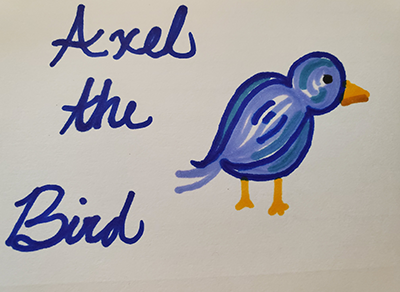

# AxelTheBird

## Description

### This is the story of Axel the bird and his adventures to get food. The adventures are randomly generated using a switch statement. It is set to a simple piece of music I made on my keyboard.  The project is built in p5.js which is a javascript library used for creating visual tools that uses a canvas. it also uses a gui tool (that is constructed in p5.js) to stop and start the music. 

## Table of Contents
* [Description](#Description)
* [Technologies Used](#Technologies_Used)
* [Deployed Site](#Deployed)
* [Features](#Features)
* [Usage](#Usage)
* [Author](#Author)
* [Credits](#Credits)
* [License](#License)

## Technologies_Used
* HTML
* [p5.js](https://p5js.org/)

## Deployed Site
[AxelTheBird](https://rksouth.github.io/AxelTheBird/)

## Features 

### Music

#### I recorded the song, that I wrote and played on my own casio keyboard. 

### Switch Statements

#### This project is primarily created and developed using switch statements that loop through with a series of  if statements.  For instance, if you fly to the houses, then go to the window or to the plants but not to the lake or the ground. You can either find a worm, a fly or a sad Axel. Once any of the three choices are randomly selected then Axel flies again and choose a new route. This process continues forever. 

###  Original Art and Photography
#### All of the drawings are my own made with sharpy markers on card stock. All of the photographs are other free to use, or taken by me personally. 

  
## Usage
### This is meant to be a fun story that demonstrates the use of switch statements, so enjoy! 

## Author 
Rachael Kelm-Southworth

* [linkedin] (https://www.linkedin.com/in/rachael-kelm-southworth-87a3831b3) 

* [github] (https://github.com/RKSouth/)

 <!-- ## Credits

I would like to thank Kerwin, Manuel, Roger, Jerome and all my classmates for helping me understand this subject matter and anyone that contributed to make the base code. -->

## License
[MIT](https://choosealicense.com/licenses/mit/)

